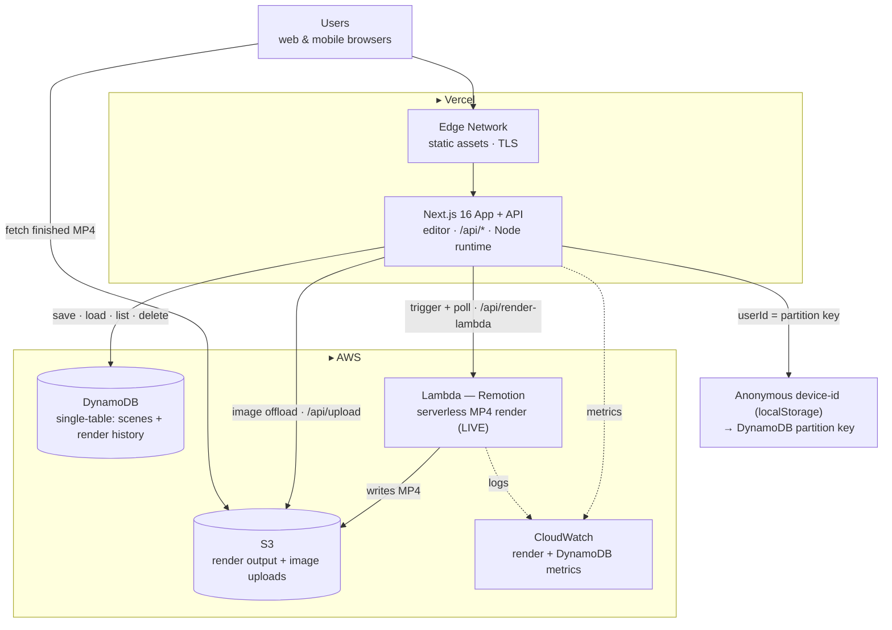

# Aqua Studio

**Design a broadcast‑quality animated title in your browser — and render a real MP4 in the cloud. No After Effects, no designer, no sign‑in.**

<p align="center">
  
</p>

<p align="center">
  
</p>

<p align="center">
  🔗 <b>Live:</b> <a href="https://aqua-studio-mu.vercel.app">aqua-studio-mu.vercel.app</a> &nbsp;·&nbsp; Stack: <b>Vercel + AWS DynamoDB + Lambda + S3</b>
</p>

---

## The problem

Great animated titles — the bold, editorial kind — are **gatekept**. They mean a day in After Effects (dozens of panels, hundreds of keyframes) or hundreds of dollars for a motion designer. Creators, founders, and students get priced and skilled out, so most ideas never become motion.

## How we solved it

Aqua Studio is a **procedural motion studio in the browser**. A deterministic, seeded engine lays heavy condensed type on a grid and scatters geometric shapes around it — the live preview matches the exported MP4 **frame‑for‑frame**.

- **Live editor** — drag titles, tune density/motion, pick a palette, add music. Everything editable.
- **One‑click MP4** — render a real H.264 MP4 in any aspect ratio.
- **Saved per user** — every scene *and* render persists in DynamoDB, so you can come back to anything you've made.
- **Zero friction** — no sign‑in; an anonymous device‑id is your key.

<p align="center">
  
</p>

---

## Why DynamoDB — used deliberately, not as a key‑value box

> Every read in this app is the same question — *"give me everything one user owns, newest first."* That's a single‑partition, **single‑digit‑millisecond** query with **no Scans, ever** — and because ownership is enforced by the partition key itself, the app needs **no sign‑in**.

It's a **single‑table design** (`app/lib/db.ts`):

```
PK = USER#<userId>
SK = SCENE#<sceneId>              → a saved scene
     RENDER#<paddedTimestamp>#<id> → a render-history event

GSI1 (sparse — scenes only) → list a user's scenes by recency
```

- A user's **scenes and render history live in one partition** — returned in a single Query, never a table Scan.
- **Ownership is enforced by the key**, not application code — a caller can only address items in their own partition (which is why there's no login).
- A **sparse GSI** sorts scenes by recency; render events carry a **TTL**; reads are **paginated cursors**.

<p align="center">
  
</p>

---

## Architecture



Full write‑ups: **[`docs/technical-architecture.md`](docs/technical-architecture.md)** (every AWS service + how it's used), [`docs/system-design.md`](docs/system-design.md) (scale math, data model, bottlenecks). Infrastructure‑as‑code in [`terraform/`](terraform).

---

## Other features

- **Procedural pattern engine** — 16 geometric shape kinds, a flood‑grid intro, and audio‑reactive motion.
- **Serverless rendering** — MP4s render on **AWS Lambda** (headless Chromium + ffmpeg can't run on Vercel) and stream from **S3**. Works on the live site with no server.
- **Multi‑format export** — MP4 / WebM / GIF in 16:9, 1:1, 9:16 and more (local render server).
- **Observability + IaC** — **CloudWatch** metrics; the full AWS stack defined in **Terraform**.

## Tech stack

| Area | Tech |
| --- | --- |
| Frontend / editor | Next.js 16, React 19, TypeScript, Tailwind 4, Radix UI |
| Animation / preview | Remotion 4, `@remotion/player`, audio‑reactive utils |
| **Database** | **Amazon DynamoDB** — single‑table (`@aws-sdk/lib-dynamodb`) |
| **Serverless render** | **AWS Lambda** via `@remotion/lambda` → **Amazon S3** |
| Observability / IaC | **Amazon CloudWatch** · **Terraform** |
| Deploy | **Vercel** |

---

## Run it locally

```bash
npm install
cp .env.example .env
```

Set your AWS credentials in `.env` (for save / load / render history):

```bash
AWS_REGION=us-east-1
AWS_ACCESS_KEY_ID=...
AWS_SECRET_ACCESS_KEY=...
AWS_DYNAMODB_TABLE_NAME=pattern-studio-scenes
```

```bash
npm run setup:db   # create the single table + GSI1
npm run dev        # editor + API → http://localhost:3000
npm run server     # local MP4 render backend → http://localhost:3001
```

> The deployed app renders on **AWS Lambda** (see [`docs/LAMBDA-SETUP.md`](docs/LAMBDA-SETUP.md)); `npm run server` is the local fallback.

---

## Attribution

- The pattern‑placement engine in `src/lib/patterngen/` is **ported and adapted from [`patterngen-oss`](https://github.com/halfof8/patterngen) by halfof8 (MIT)** — re‑implemented to be Remotion‑native and deterministic, with a new product built around it. Full details in [`NOTICE.md`](NOTICE.md).
- [Remotion](https://www.remotion.dev) (video framework), Google Fonts **Anton** & **Shippori Mincho** (OFL), and **CC0** music/SFX.

## License

[MIT](LICENSE) © 2026 Trishit Bodkhe
