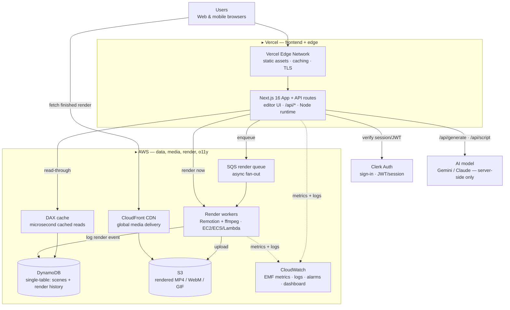

# Aqua Studio — Architecture

A full-stack motion-graphics studio: a Vercel-hosted Next.js frontend over an
AWS data + media backend, with **DynamoDB** as the primary database.

## System diagram

## Components

| Box | What it is | What it does |
|-----|-----------|--------------|
| **Vercel Edge Network** | CDN / edge | Serves the Next.js static bundle globally, terminates TLS, caches assets |
| **Next.js 16 App + API** | App + application logic | Editor UI + `/api/*` routes (Node runtime). All AI keys and AWS credentials stay server-side |
| **Clerk Auth** | Auth service | Sign-in + session/JWT; `userId` becomes the DynamoDB partition key, so ownership is enforced by the key |
| **DynamoDB** | Primary database | Single-table design: each user's scenes **and** render history live in one item collection; sparse GSI1 for recency. Single-partition Queries, never a Scan |
| **DAX** | In-memory DB cache | Read-through cache for the hot `listScenes` path — microsecond cached reads (app falls back to an in-process TTL cache when DAX is off) |
| **S3** | Object storage | Stores every rendered MP4/WebM/GIF under `renders/<id>/`; private, encrypted, 7-day lifecycle |
| **CloudFront** | CDN | Delivers rendered media globally via Origin Access Control (bucket stays private) |
| **SQS render queue** | Message queue | Async render fan-out to a worker pool; DLQ after 3 failed attempts |
| **Render workers** | Background processing | Remotion + headless Chromium + ffmpeg; can't run on Vercel (time/FS limits), so they run on long-lived compute |
| **CloudWatch** | Observability | EMF metrics (render latency, scene ops, AI latency, errors), log groups, a p90-latency alarm, and a dashboard |

## Why DynamoDB (one sentence)

> We chose **DynamoDB** because the entire access pattern is *"give me everything
> one user owns, newest first"* — a single-partition key-ordered read that
> DynamoDB serves in single-digit milliseconds at any scale, with ownership
> enforced by the partition key itself rather than by application code.

The data model is documented in full in [`app/lib/db.ts`](../app/lib/db.ts) and
provisioned as IaC in [`terraform/main.tf`](../terraform/main.tf).

## Well-Architected mapping

| Pillar | How it shows up here |
|--------|----------------------|
| **Operational excellence** | EMF metrics + CloudWatch dashboard/alarms; all infra in Terraform |
| **Security** | Server-side-only credentials; least-privilege IAM (`terraform/iam.tf`); Vercel OIDC role (no stored keys); private encrypted S3; ownership-by-partition-key |
| **Reliability** | DynamoDB on-demand + point-in-time recovery; SQS DLQ; multi-AZ DAX; storage failures never fail a render |
| **Performance efficiency** | DAX + in-process cache; CloudFront for media; single-partition queries, zero Scans |
| **Cost optimization** | On-demand DynamoDB (scales to zero); S3 lifecycle expiry; CloudFront `PriceClass_100`; heavy infra (DAX/SQS) feature-flagged off until needed |

## What's live vs. provisioned

- **Live today:** Vercel frontend + API, Clerk auth, DynamoDB single-table,
  in-process read cache, S3 upload of renders (when `AWS_S3_BUCKET` is set),
  CloudWatch EMF metrics, the render server.
- **Provisioned in Terraform, flag-gated:** DAX (`enable_dax`), SQS render queue
  (`enable_render_queue`), CloudFront (`enable_cdn`, on by default). These are
  the documented scale path — real IaC, switched on when traffic warrants.
