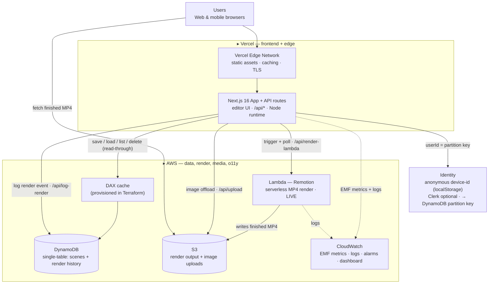

# Aqua Studio — Architecture

A full-stack motion-graphics studio: a Vercel-hosted Next.js frontend over an
AWS backend, with **DynamoDB** as the primary database, **Lambda** for serverless
rendering, and **S3** for media. No sign-in required.

## System diagram

## Components

| Box | What it is | What it does |
|-----|-----------|--------------|
| **Vercel Edge Network** | CDN / edge | Serves the Next.js static bundle globally, terminates TLS, caches assets |
| **Next.js 16 App + API** | App + application logic | Editor UI + `/api/*` routes (Node runtime). All AWS credentials stay server-side |
| **Identity** | Auth | A persistent **anonymous device-id** in `localStorage` is the DynamoDB partition key — zero-friction, no sign-in. Clerk is an optional account layer |
| **DynamoDB** | Primary database | Single-table design: each user's scenes **and** render history in one item collection; sparse GSI1 for recency; paginated; render events TTL'd. Single-partition Queries, never a Scan |
| **Lambda (Remotion)** | Serverless compute | **Renders MP4s on AWS Lambda** (`renderMediaOnLambda`) — trigger + poll, writes the output to S3. Live on the deployed site, no server to run |
| **S3** | Object storage | Holds Lambda render outputs and user-uploaded background images; the DynamoDB item stores only the URL |
| **DAX** | In-memory DB cache | The production read-cache path, **provisioned in Terraform**; today the live cache is an in-process TTL cache (`app/lib/cache.ts`) on the `listScenes` hot path |
| **CloudWatch** | Observability | EMF metrics (render latency, scene ops, errors), log groups, a p90-latency alarm, and a dashboard |

## Primary request flows

**Save / load (DynamoDB):** editor → `/api/save` → `UpdateItem` on `USER#<id> / SCENE#<id>`; reload via `/api/list` (paginated Query on GSI1) and `/api/load` (strongly-consistent GetItem).

**Render (Lambda → S3):** editor → `/api/render-lambda` → `renderMediaOnLambda()` returns `{renderId, bucketName}` → client polls `/api/render-lambda/progress` (`getRenderProgress`) until done → Lambda has written `out.mp4` to S3 → browser plays the public URL → `/api/log-render` records a `RENDER#` event in DynamoDB.

## Why DynamoDB (one sentence)

> We chose **DynamoDB** because the entire access pattern is *"give me everything
> one user owns, newest first"* — a single-partition key-ordered read that
> DynamoDB serves in single-digit milliseconds at any scale, with ownership
> enforced by the partition key itself rather than by application code.

Data model: [`app/lib/db.ts`](../app/lib/db.ts) · IaC: [`terraform/main.tf`](../terraform/main.tf).

## Well-Architected mapping

| Pillar | How it shows up here |
|--------|----------------------|
| **Operational excellence** | EMF metrics + CloudWatch dashboard/alarms; all infra in Terraform |
| **Security** | Server-side-only credentials; least-privilege IAM (`terraform/iam.tf`) + a dedicated `remotion-lambda-role`; private S3; ownership-by-partition-key |
| **Reliability** | DynamoDB on-demand + point-in-time recovery; render is a stateless Lambda invocation (retry-safe); storage failures never fail a save |
| **Performance efficiency** | In-process read cache (DAX path provisioned); single-partition queries, zero Scans; Lambda scales render concurrency automatically |
| **Cost optimization** | On-demand DynamoDB (scales to zero); Lambda + S3 cost cents per render; TTL on render events; heavy infra (DAX/SQS) feature-flagged off until needed |

## What's live vs. provisioned

- **Live today (on the deployed site):** Vercel frontend + API, anonymous
  identity, DynamoDB single-table (save/load/list/delete + render history),
  in-process read cache, **AWS Lambda serverless rendering → S3**, S3 image
  offload, CloudWatch EMF metrics.
- **Provisioned in Terraform, flag-gated (documented scale path):** DAX
  (`enable_dax`), SQS render queue for async fan-out (`enable_render_queue`),
  CloudFront over the media bucket (`enable_cdn`). Real IaC, switched on when
  traffic warrants.
